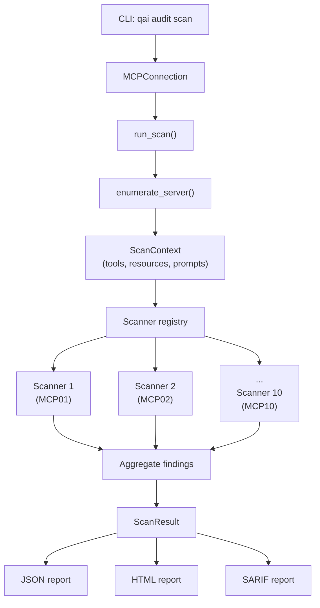

The audit module is an automated security scanner for MCP servers. It runs 10 scanner modules — one per OWASP MCP Top 10 category — against a target server and produces structured findings.

## File layout

```
src/q_ai/audit/
├── cli.py              # Typer subcommands (scan, list-checks, enumerate, report)
├── orchestrator.py     # ScanResult dataclass + run_scan() entry point
├── scanner/
│   ├── base.py         # BaseScanner ABC + re-exports from core.models
│   ├── registry.py     # Scanner registry — maps CLI names to scanner classes
│   ├── injection.py    # MCP05 — Command Injection
│   ├── auth.py         # MCP07 — Authentication/Authorization
│   ├── token_exposure.py   # MCP01 — Token Mismanagement
│   ├── permissions.py      # MCP02 — Privilege Escalation
│   ├── tool_poisoning.py   # MCP03 — Tool Poisoning
│   ├── supply_chain.py     # MCP04 — Supply Chain & Integrity
│   ├── prompt_injection.py # MCP06 — Indirect Prompt Injection
│   ├── audit_telemetry.py  # MCP08 — Audit & Telemetry
│   ├── shadow_servers.py   # MCP09 — Shadow MCP Servers
│   └── context_sharing.py  # MCP10 — Context Over-Sharing
├── payloads/           # Injection payload generators
├── reporting/
│   ├── json_report.py  # JSON output (base format)
│   ├── html_report.py  # HTML report generation
│   ├── sarif_report.py # SARIF output for CI/CD integration
│   └── severity.py     # Severity display utilities
├── mcp_client/         # Re-export shims → core.connection, core.discovery
└── utils/              # Scan-specific utilities
```

## Data flow



## Key components

### BaseScanner

Abstract base class in `scanner/base.py`. Every scanner extends this and implements a single method:

```python
async def scan(self, context: ScanContext) -> list[Finding]
```

Each scanner declares three class attributes:

| Attribute | Example | Description |
|-----------|---------|-------------|
| `name` | `"injection"` | CLI name used for `--checks` filtering |
| `owasp_id` | `"MCP05"` | OWASP MCP Top 10 category |
| `description` | `"Tests for command injection..."` | Human-readable description |

### Scanner registry (`registry.py`)

A static dictionary mapping CLI name strings to scanner classes:

```python
_REGISTRY: dict[str, type[BaseScanner]] = {
    "injection": InjectionScanner,
    "auth": AuthScanner,
    "permissions": PermissionsScanner,
    # ... 10 total
}
```

The CLI's `--checks` option filters by these names. `get_scanner(name)` instantiates a single scanner; `get_all_scanners()` returns instances of all ten.

### Orchestrator (`orchestrator.py`)

`run_scan(conn, check_names)` coordinates the full scan lifecycle:

1. Calls `enumerate_server(conn)` to populate a `ScanContext`
2. Resolves the scanner list from the registry (all, or filtered by `check_names`)
3. Runs each scanner's `scan()` sequentially, collecting findings
4. Catches and logs per-scanner errors without aborting the run
5. Returns a `ScanResult` with all findings and metadata

### ScanResult

Dataclass aggregating scan output:

| Field | Type | Description |
|-------|------|-------------|
| `findings` | `list[Finding]` | All findings from all scanners |
| `server_info` | `dict[str, Any]` | Server metadata from MCP handshake |
| `tools_scanned` | `int` | Number of tools tested |
| `scanners_run` | `list[str]` | Names of scanners that executed |
| `started_at` | `datetime` | Scan start time |
| `finished_at` | `datetime \| None` | Scan completion time |
| `errors` | `list[dict[str, str]]` | Per-scanner errors |

### Reporting pipeline

Three output formats, all generated from the same `ScanResult`:

| Format | File | Use case |
|--------|------|----------|
| **JSON** | `json_report.py` | Base format — machine-readable findings with full metadata |
| **HTML** | `html_report.py` | Human-readable report with severity summaries and finding details |
| **SARIF** | `sarif_report.py` | Static Analysis Results Interchange Format for CI/CD integration |

## Test layout

```
tests/audit/
├── conftest.py                 # Shared fixtures
├── test_orchestrator.py        # Orchestrator unit tests
├── test_smoke.py               # CLI smoke tests
├── test_html_report.py         # HTML report generation tests
├── test_sarif_report.py        # SARIF report generation tests
├── test_scanners/              # Per-scanner unit tests
│   ├── test_injection.py       # MCP05
│   ├── test_auth.py            # MCP07
│   ├── test_token_exposure.py  # MCP01
│   ├── test_permissions.py     # MCP02
│   ├── test_tool_poisoning.py  # MCP03
│   ├── test_supply_chain.py    # MCP04
│   ├── test_prompt_injection.py # MCP06
│   ├── test_audit_telemetry.py # MCP08
│   ├── test_shadow_servers.py  # MCP09
│   └── test_context_sharing.py # MCP10
└── test_mcp_client/
    └── test_integration.py     # MCP transport integration tests
```
