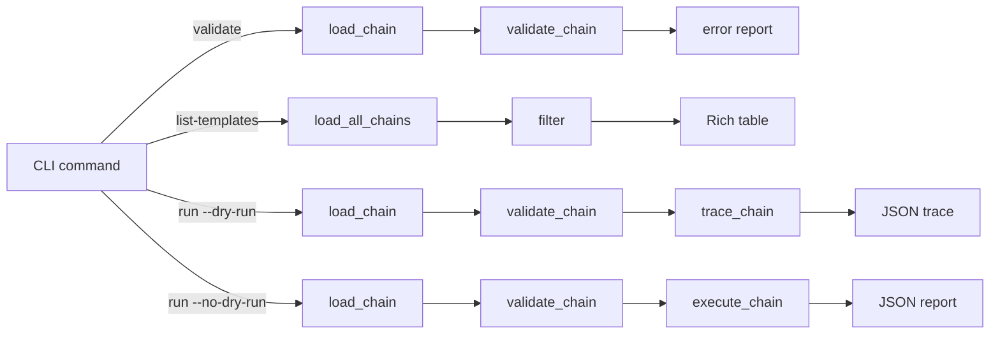

The chain module provides a declarative framework for defining, validating, and executing multi-step attack paths that link audit scanners and inject techniques into exploitation sequences.

## File layout

```
src/q_ai/chain/
├── cli.py              # Typer subcommands (validate, list-templates, run, blast-radius, detect)
├── models.py           # Data models (ChainDefinition, ChainStep, ChainResult, enums, interpret prompt)
├── loader.py           # YAML discovery, parsing, and structural validation
├── validator.py        # Semantic validation — module refs, graph analysis
├── tracer.py           # Dry-run tracer — walks success path, tracks trust boundaries
├── executor.py         # Live execution engine — dispatches to audit/inject, collects evidence
├── executor_models.py  # StepOutput, TargetConfig with YAML loader
├── artifacts.py        # Automatic artifact extraction from audit/inject results
├── variables.py        # $step_id.artifact_name variable resolution
└── templates/          # Built-in chain YAML files (3 templates)
```

## Data flow



**Current state:** Validation, dry-run tracing, and live execution all work. The executor dispatches audit steps to `run_scan()` and inject steps to `run_campaign()` with single-payload first-match selection. Target configuration via `chain-targets.yaml` with CLI overrides. Variable resolution passes artifacts between steps via `$step_id.artifact_name` references.

## Key components

### ChainDefinition and ChainStep (models.py)

`ChainDefinition` holds the chain metadata (id, name, category, description) and an ordered list of `ChainStep` objects. Each step specifies a module (`audit` or `inject`), a technique, optional trust boundary, routing (`on_success`/`on_failure`), input variable references, and whether it's terminal.

`ChainCategory` enum defines four architecture patterns: `rag_pipeline`, `agent_delegation`, `mcp_ecosystem`, `hybrid`.

`ChainResult` supports both dry-run tracing (`steps` field) and live execution (`step_outputs` field). The `_build_interpret_prompt()` method generates an AI-evaluation prompt summarizing the execution path, outcomes, and trust boundaries — matching the pattern used by audit reports and inject campaigns.

### Loader (loader.py)

`load_chain(path)` parses a single YAML file into a `ChainDefinition`:

1. YAML safe-load with error handling for encoding and parse failures
2. Validates required top-level fields (`id`, `name`, `category`, `description`, `steps`)
3. Validates `category` against the `ChainCategory` enum
4. Parses each step dict, enforcing required fields (`id`, `name`, `module`, `technique`)
5. Ensures step ID uniqueness within the file

`load_all_chains()` discovers all YAML files in the templates directory and enforces chain ID uniqueness across files.

### Validator (validator.py)

`validate_chain(chain)` performs six ordered checks, returning a list of `ValidationError` objects:

| Check | What it validates |
|-------|-------------------|
| 1. Module refs | `step.module` must be `audit` or `inject` |
| 2. Technique refs | Technique must exist in the audit scanner registry or inject technique enum |
| 3. Graph refs | `on_success`/`on_failure` targets must be valid step IDs or `abort` |
| 4. Cycle detection | DFS with three-color marking to detect circular step references |
| 5. Reachability | BFS from the first step to ensure all steps are reachable |
| 6. Terminal steps | At least one step must be marked `terminal` or be the implicit last step |

### Dry-run tracer (tracer.py)

`trace_chain(chain)` walks the success path without making network calls or sending payloads. Starts at the first step, follows `on_success` routing, records trust boundaries, and returns a `TraceResult` showing what a live execution would do.

## Execution engine

### Executor (executor.py)

`execute_chain(chain, target_config)` is the async entry point for live execution. It walks the step graph, dispatches each step to the appropriate module, collects `StepOutput` objects, and routes on success/failure.

**Execution flow:**

1. Build step lookup map and ordered step list
2. Start at the first step
3. For each step: resolve input variables from the accumulated artifact namespace
4. Dispatch to `execute_audit_step()` or `execute_inject_step()`
5. Extract artifacts automatically from the step result
6. Route: success → `on_success`, failure → `on_failure` or abort
7. Cycle and missing-step detection emit FAILED StepOutput markers

**Error handling:** All dispatcher exceptions are caught and converted to FAILED `StepOutput` objects. The chain never crashes — it records the failure and routes accordingly.

### Dispatchers

**`execute_audit_step()`** connects to an MCP server via `MCPConnection` (stdio, SSE, or streamable-http), runs the specified scanner, and extracts standard audit artifacts. Windows-compatible command parsing via `shlex.split(posix=False)`.

**`execute_inject_step()`** loads all payload templates, filters by technique, takes the first match (deterministic single-payload selection), applies input overrides from upstream artifacts via `deepcopy`, and runs a single-round campaign.

### StepOutput and TargetConfig (executor_models.py)

`StepOutput` captures: step_id, module, technique, success, status, scan_result or campaign, extracted artifacts, timing, and error. `to_dict()` serializes metadata fields (excludes large scan_result/campaign objects).

`TargetConfig` holds audit connection details (transport, command, URL) and inject model. Loads from `chain-targets.yaml` via `from_yaml()` with `QAI_MODEL` env var fallback. Supports field overrides via `with_overrides()`.

### Artifact extraction (artifacts.py)

Automatic extraction using duck typing (`getattr` with defaults) to avoid circular imports.

**Audit artifacts:** `vulnerable_tool`, `vulnerability_type`, `finding_count`, `finding_evidence` — extracted from the highest-severity finding.

**Inject artifacts:** `best_outcome`, `working_payload`, `working_technique`, `compliance_rate` — extracted from the first successful result.

### Variable resolution (variables.py)

`resolve_variables(inputs, artifact_namespace)` substitutes `$step_id.artifact_name` references in step inputs against the accumulated namespace from prior steps.

- Only strings starting with `$` are treated as variable references
- Format: `$step_id.artifact_name` (split on first `.`)
- Non-string values (int, bool from YAML) pass through unchanged
- Unresolvable references raise `ValueError` with available artifacts listed

### Report output

`write_chain_report(result, output_path)` writes a JSON report enriched with module-specific summaries: severity counts for audit steps, outcome/payload info for inject steps. The report includes the interpret prompt for AI-assisted analysis. Sensitive target config fields (audit_command, audit_url) are redacted to `<configured>` to prevent credential leakage.
