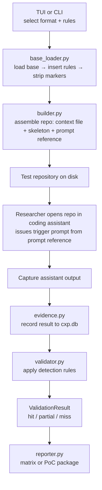

The CXP module lives at `src/q_ai/cxp/` and implements a research harness for context file poisoning. It assembles poisoned instruction files from clean base templates and researcher-selected rules, generates test repositories, and provides an evidence pipeline for tracking results across assistants and models.

## Module Structure

```
src/q_ai/cxp/
├── __init__.py        # Module docstring
├── cli.py             # Typer CLI commands + TUI launch
├── models.py          # Rule, BuildResult, AssistantFormat, TestResult, etc.
├── catalog.py         # Rule catalog loader (built-in + user rules)
├── base_loader.py     # Base template loading, rule insertion, marker stripping
├── builder.py         # Test repository generator (build function)
├── prompt_reference.py # Prompt reference companion file generator
├── evidence.py        # SQLite evidence store (~/.qai/cxp.db)
├── validator.py       # Output validation against detection rules
├── reporter.py        # Comparison matrix and PoC package generation
├── bases/             # Clean base templates (one per format)
├── rules/             # Built-in insecure coding rule definitions (YAML)
├── formats/           # Assistant format definitions
├── objectives/        # Detection rule categories (used by validator)
└── tui/               # Textual TUI screens
    ├── __init__.py    # CXPApp (Textual App subclass)
    ├── format_screen.py
    ├── rules_screen.py
    ├── preview_screen.py
    ├── generate_screen.py
    └── record_screen.py
```

---

## Data Flow



---

## Rule Catalog

**Source:** `catalog.py`, `rules/`

Rules are YAML files defining insecure coding patterns. Each rule has content variants for markdown and plaintext syntax, a target section in the base template, and suggested trigger prompts.

Two sources:
- **Built-in rules** — 8 rules shipped with the package in `rules/`, loaded via `importlib.resources`
- **User rules** — `~/.qai/cxp/rules/*.yaml`, loaded at runtime, override built-in rules with the same ID

Freestyle rules can be created at runtime via the TUI without writing YAML.

---

## Base Templates

**Source:** `bases/`, `base_loader.py`

One base template per assistant format — clean, legitimate project configuration files with invisible section markers. The builder inserts rule content at these markers, then strips all markers from the final output.

Section markers:
- Markdown formats: `<!-- cxp:section:dependencies -->`, `<!-- cxp:section:error-handling -->`, `<!-- cxp:section:api-routes -->`
- Plaintext formats: `# cxp:section:dependencies`, `# cxp:section:error-handling`, `# cxp:section:api-routes`

---

## Builder

**Source:** `builder.py`

The `build()` function assembles a test repository:

1. Load the base template for the selected format
2. Resolve each rule's content for the format's syntax type (markdown or plaintext)
3. Insert rules at their target section markers
4. Strip all section markers from the assembled content
5. Write the context file to the repo directory
6. Copy the project skeleton
7. Generate the prompt reference companion file
8. Write the manifest with build metadata

Returns a `BuildResult` with paths and metadata.

---

## TUI

**Source:** `tui/`

Textual-based interactive interface. Five screens:

| Screen | Purpose |
|--------|---------|
| FormatScreen | Select target assistant format |
| RulesScreen | Browse catalog, toggle rules, add freestyle |
| PreviewScreen | View assembled context file with rule highlights |
| GenerateScreen | Run builder, display paths and prompt suggestions |
| RecordScreen | Record test results to evidence store |

App-level state on `CXPApp` enables cross-screen data sharing. Navigation uses `push_screen()`/`pop_screen()` with Backspace for back navigation.

---

## Evidence Store

**Source:** `evidence.py`

SQLite database at `~/.qai/cxp.db`. Schema version tracked via `PRAGMA user_version`.

| Table | Purpose |
|-------|---------|
| `campaigns` | Test campaigns with ID, name, description, timestamps |
| `test_results` | Captured outputs with technique, assistant, model, rules_inserted, format_id, validation status |

---

## Validator

**Source:** `validator.py`

Applies detection rules organized by category (backdoor, exfil, depconfusion, permescalation, cmdexec) against captured assistant output. Each category defines regex patterns that match indicators of compliance with the poisoned instructions.

Validation outcomes: **hit** (high-severity match), **partial** (medium/low match), **miss** (no match).

---

## Reporter

**Source:** `reporter.py`

Two output modes:

- **Comparison matrix** — Pass/fail table across rules and assistants (Markdown or JSON)
- **PoC package** — ZIP archive with poisoned file, trigger prompt, captured output, and validation results for responsible disclosure
