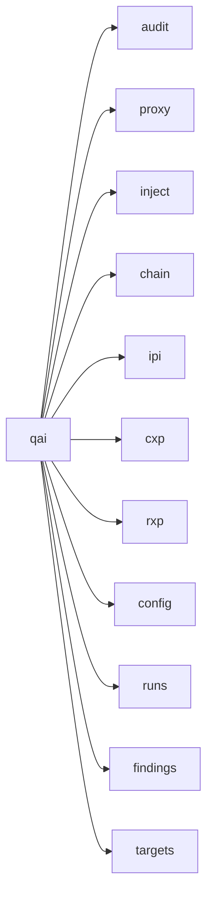

q-ai is a single Python package (`q-uestionable-ai`) with seven security modules, a shared core layer, a web UI, and workflow orchestration — all installed together.

## Package layout

```
src/q_ai/
├── __init__.py         # Package version
├── __main__.py         # python -m q_ai support
├── cli.py              # Root Typer app — mounts all module subcommands
├── core/               # Shared DB, config, models, framework resolver, LLM provider client
├── server/             # FastAPI + HTMX + WebSocket web UI
├── orchestrator/       # Workflow runner, adapter registry, event system
├── audit/              # MCP server security scanner (OWASP MCP Top 10)
├── proxy/              # MCP traffic interceptor
├── inject/             # Tool poisoning & prompt injection framework
├── chain/              # Multi-agent attack chain exploitation
├── ipi/                # Indirect prompt injection testing
├── cxp/                # Context file poisoning research harness
├── rxp/                # RAG retrieval poisoning validation
└── mcp/                # MCP protocol utilities
```

Each module has its own `cli.py` defining Typer subcommands, its own models, and its own test directory under `tests/`.

## CLI hierarchy

The root `cli.py` creates a Typer app and mounts subcommand groups via `app.add_typer()`:



Running `qai` with no subcommand starts the web UI server and opens a browser.

## Technology stack

| Component | Technology | Rationale |
|-----------|-----------|-----------|
| Language | Python >=3.11 | Async-native, rich ecosystem for security tooling |
| MCP SDK | mcp v1.x | Official SDK, stable API |
| CLI | Typer + Rich | Declarative CLI with auto-generated help |
| Web UI | FastAPI + HTMX + Jinja2 + WebSocket | Server-rendered UI with live updates |
| LLM providers | litellm | 100+ providers behind a unified interface |
| Credentials | keyring | OS-native secret storage |
| Database | SQLite (WAL mode) | Single-file, zero-config, schema-versioned |
| Async | asyncio (stdlib), anyio at MCP SDK boundary | Standard library async |
| Serialization | Pydantic | Type-safe data models with validation |
| Testing | pytest + pytest-asyncio + pytest-timeout | Async test support, fixture-based |
| Linting | ruff | Fast, unified linter and formatter |
| Type checking | mypy (strict) | Static type verification |
| Packaging | hatchling + uv | Modern Python packaging with fast dependency resolution |

## Shared core

The `core/` package provides infrastructure shared across all modules:

- **Database** — SQLite with WAL pragma, schema migration via `PRAGMA user_version`, common CRUD for runs, findings, targets, evidence, settings
- **Config** — Config file loader, credential management via OS keyring, settings precedence resolver (CLI flag → env var → DB setting → config file → built-in default)
- **Models** — Shared data models: `Run`, `Target`, `Finding`, `Evidence`, `Severity`, `RunStatus`
- **Framework resolver** — Maps findings to OWASP MCP Top 10, OWASP Agentic, MITRE ATLAS, CWE from YAML definitions
- **LLM provider client** — `ProviderClient` protocol backed by litellm, `NormalizedResponse` for cross-provider response handling

## Web UI and orchestration

The **server** package provides a FastAPI application with HTMX-driven pages: a workflow launcher, operations view (live status via WebSocket), research management (runs, findings, targets), and settings (provider configuration, defaults, infrastructure status).

The **orchestrator** package provides `WorkflowRunner` for parent/child run lifecycle management, thin module adapters (e.g., `AuditAdapter`, `InjectAdapter`, `IPIAdapter`), and event broadcasting to connected WebSocket clients.

## Module architecture pages

Each module has a dedicated architecture page:

- [Shared Core](/architecture/core) — database, config, models, framework resolver, LLM client
- [Audit Module](/architecture/audit-module) — scanner framework, orchestrator, reporting
- [Proxy Module](/architecture/proxy-module) — pipeline, intercept engine
- [Inject Module](/architecture/inject-module) — payload loading, server builder, campaigns
- [Chain Module](/architecture/chain-module) — loader, validator, graph analysis, tracer
- [IPI Module](/architecture/ipi-module) — generator framework, callback server, dashboard
- [CXP Module](/architecture/cxp-module) — builder pipeline, evidence store, validator, reporter
- [RXP Module](/architecture/rxp-module) — embedding registry, retrieval validation