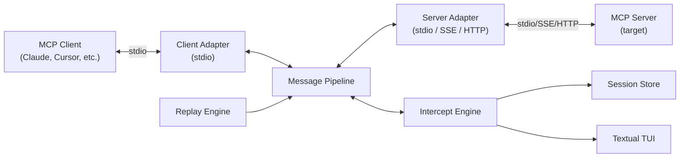
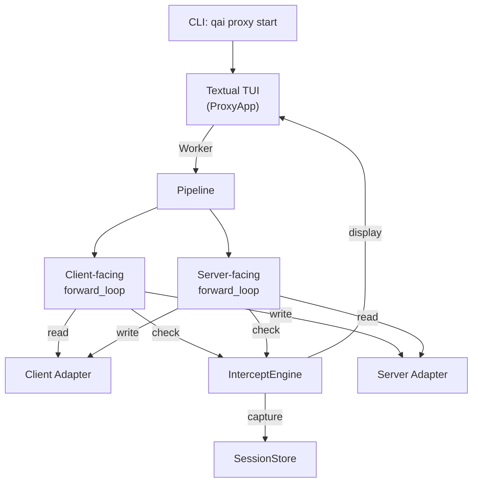

The proxy module is an interactive MCP traffic interceptor — "Burp Suite for MCP." It sits between an MCP client and server, capturing, inspecting, and optionally modifying JSON-RPC messages in real time.

## Design principle

**SDK for transport, raw for messages.** The proxy uses the MCP SDK's transport functions for connection setup but operates on raw `JSONRPCMessage` objects for maximum flexibility. This gives full visibility into every message without SDK abstraction layers filtering or transforming content.

## File layout

```
src/q_ai/proxy/
├── cli.py              # Typer subcommands (start, replay, export, inspect)
├── models.py           # ProxyMessage, ProxySession, HeldMessage, InterceptAction
├── pipeline.py         # Message pipeline (bidirectional forwarding loops)
├── intercept.py        # InterceptEngine (hold/release/breakpoint logic)
├── session_store.py    # SessionStore (capture, save/load, export)
├── replay.py           # ReplayEngine (re-send captured messages)
├── correlation.py      # Request-response correlation by JSON-RPC id
├── exporting/          # Session export formats
├── adapters/
│   ├── __init__.py     # TransportAdapter protocol + exports
│   ├── stdio.py        # StdioServerAdapter, StdioClientAdapter
│   ├── sse.py          # SseServerAdapter
│   └── streamable_http.py  # StreamableHttpServerAdapter
└── tui/
    ├── app.py          # ProxyApp — main Textual application
    ├── messages.py     # Custom Textual messages (MessageReceived, etc.)
    └── widgets/
        ├── message_list.py    # Message list panel
        ├── message_detail.py  # Message detail/edit panel
        └── status_bar.py      # Proxy status bar
```

## Architecture diagram



## Data flow



The pipeline runs two concurrent `_forward_loop` tasks — one for client-to-server traffic, one for server-to-client. Each loop reads from one adapter, passes the message through the intercept engine, and writes to the other adapter. The session store captures every message as an ordered sequence.

## Key abstractions

### TransportAdapter protocol

Defined in `adapters/__init__.py`. All transport adapters implement three methods:

| Method | Description |
|--------|-------------|
| `read()` | Async read of the next `JSONRPCMessage` from the transport |
| `write(message)` | Async write of a `JSONRPCMessage` to the transport |
| `close()` | Clean shutdown of the transport connection |

### InterceptEngine (`intercept.py`)

Holds messages via `asyncio.Event` until the user acts through the TUI. Three possible actions:

| Action | Effect |
|--------|--------|
| `FORWARD` | Release the message unmodified |
| `MODIFY` | Release with user-edited content |
| `DROP` | Discard the message silently |

The engine supports breakpoints — rules that automatically hold messages matching specific criteria (method name, direction, content patterns).

### SessionStore (`session_store.py`)

Captures all proxied messages as an ordered `ProxyMessage` sequence. Supports save/load to JSON for offline analysis, and export to various formats.

### ProxyMessage (`models.py`)

Envelope wrapping a raw JSON-RPC message with proxy metadata:

| Field | Description |
|-------|-------------|
| `direction` | `CLIENT_TO_SERVER` or `SERVER_TO_CLIENT` |
| `timestamp` | When the message was captured |
| `sequence` | Monotonic ordering index |
| `correlation_id` | Links requests to their responses |
| `raw_message` | The original `JSONRPCMessage` content |

### Correlation (`correlation.py`)

Utility module that extracts JSON-RPC fields (`id`, `method`) and classifies messages (request, response, notification) without reaching into SDK internals. This insulates the pipeline from the MCP SDK's `JSONRPCMessage` internal structure.

**Implementation note:** The `cast()` calls in `correlation.py` are load-bearing. The MCP SDK's `JSONRPCMessage` is a Pydantic `RootModel` whose `.root` field is a union type. The `cast()` calls assert concrete types after `isinstance` checks, allowing type-safe field access without redundant runtime validation.

## Transport coverage

| Direction | stdio | SSE | Streamable HTTP |
|-----------|-------|-----|-----------------|
| **Server-facing** (proxy → target) | `StdioServerAdapter` | `SseServerAdapter` | `StreamableHttpServerAdapter` |
| **Client-facing** (client → proxy) | `StdioClientAdapter` | — | — |

Server-facing adapters support all three MCP transports. Client-facing adapters currently support stdio only — the proxy runs as a subprocess of the MCP client. Client-facing HTTP adapters (proxy as a standalone network service) are planned future work.

## Async model

asyncio is the primary runtime. anyio appears only inside transport adapters where the MCP SDK returns `MemoryObjectStream` pairs from its transport setup functions. All pipeline logic, intercept engine state, and TUI communication use pure asyncio primitives.
